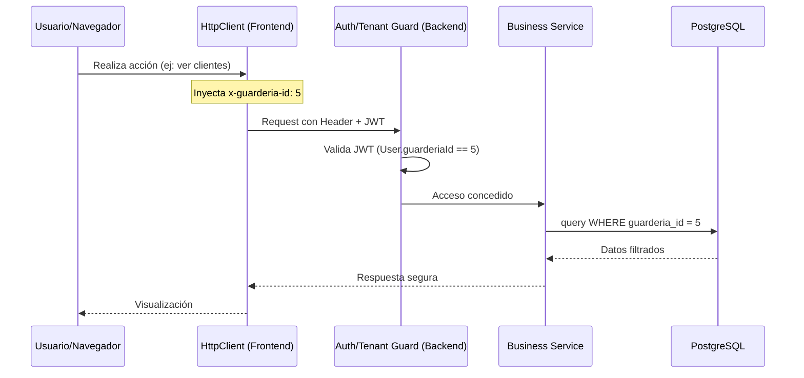

# Implementación Definitiva: Arquitectura Multi-Tenant (SaaS)

Este documento detalla la implementación técnica final de la arquitectura multi-tenant en el Gestor Náutico, basada en un modelo de **Base de Datos Compartida (Shared Schema)** con aislamiento lógico por `guarderia_id`.

---

## 🏗️ 1. Modelo de Aislamiento: Esquema Compartido
Se ha implementado el aislamiento de datos mediante la columna `guarderia_id` en todas las entidades clave del sistema (Clientes, Embarcaciones, Movimientos, Finanzas, etc.).

### Ventajas Implementadas:
- **Costos**: Mantenimiento de una única instancia de base de datos.
- **Simplicidad**: Migraciones de esquema centralizadas.
- **Visibilidad Global**: Capacidad para el rol `SUPERADMIN` de gestionar múltiples sedes desde un único panel.

---

## 🚀 2. Arquitectura del Backend (NestJS)

### A. Core de Aislamiento
1.  **`TenantContext`**: Interface que define el contexto del tenant activo (`guarderiaId`, `scope`).
2.  **`BaseTenantService`**: Clase base que todos los servicios extienden. Proporciona el método `buildTenantWhere()` para inyectar automáticamente el filtro `guarderiaId` en las consultas de TypeORM.
3.  **`TenantInterceptor`**: Extrae el `guarderiaId` del header `x-guarderia-id` y lo inyecta en el objeto `request` para que esté disponible en controladores y servicios.

### B. Seguridad y Autenticación
1.  **JWT Dinámico**: El payload del token ahora incluye el `guarderiaId` asignado al usuario.
2.  **`AuthTokenGuard`**: Valida el token y expone los datos del usuario (incluyendo su sede) en `request.user`.
3.  **`TenantGuard`**: Capa de seguridad crítica que verifica:
    - Que el `guarderiaId` solicitado en el header coincida con el asignado al usuario en su JWT.
    - Permite acceso total al `SUPERADMIN` (bypass de validación de pertenencia).
4.  **`RolesGuard` & `@TenantRoles`**: Decorador específico para proteger rutas basándose en roles dentro del contexto del tenant.

---

## ⚡ 3. Arquitectura del Frontend (React)

### A. Comunicación (HttpClient)
- **Interceptor de Peticiones**: Inyecta automáticamente el header `x-guarderia-id` desde el `localStorage`.
- **Manejo de Errores**: Intercepta respuestas `403/404` relacionadas con el tenant y redirige al usuario a `/select-tenant`.

### B. Gestión de Estado y UI
1.  **`AuthProvider`**: Inicializa automáticamente el tenant del usuario al hacer login, asegurando que las peticiones tengan el contexto correcto desde el primer segundo.
2.  **`GuarderiaSelector`**: Componente premium en el `Header` (solo para `SUPERADMIN`) que permite conmutar entre sedes en tiempo real.
3.  **`useGuarderias` Hook**: Gestión eficiente de la lista de sedes mediante `React Query`.
4.  **`SelectTenantPage`**: Página de aterrizaje de seguridad para que los SuperAdmins elijan su contexto de trabajo.

---

## 🔐 4. Flujo de Datos Seguro

---

## 📅 5. Futuras Ampliaciones (Roadmap SaaS)

### A. Aislamiento Físico (Isolated DB)
Para clientes "Enterprise", se puede implementar el **Catalog Pattern** donde el `TenantInterceptor` resuelva dinámicamente un `DataSource` (conexión) diferente basado en el slug del cliente, manteniendo la misma lógica de servicios gracias a la inyección de dependencias de NestJS.

### B. Gestión de Suscripciones
Implementar un servicio de cuotas que, basándose en el `TenantContext`, limite el número de embarcaciones o usuarios permitidos para esa sede.

---

> [!IMPORTANT]
> **Regla de Oro**: Ningún servicio debe realizar una consulta a la base de datos sin pasar por `buildTenantWhere()` o recibir el objeto `tenant: TenantContext`, garantizando que nunca se filtren datos entre sedes.
